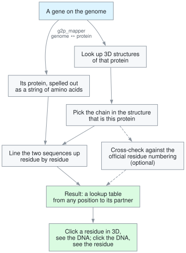

# p2s_mapper

Map a transcript's translation onto a protein structure.

- **Align** the transcript to the structure's sequence (Smith-Waterman or
  Needleman-Wunsch, BLOSUM62)
- **Convert coordinates** both ways between transcript, alignment, structure,
  Mol\* and UniProt numbering
- **Choose the chain** that is the gene's product
- **Apply SIFTS** residue numbering
- **Find structures** through AlphaFold, 3D-Beacons, PDBe and UniProt

## Works with g2p_mapper

p2s_mapper covers **protein ↔ structure**. The other half, **genome ↔ protein**,
is [g2p_mapper](https://github.com/GMOD/g2p_mapper): it turns a transcript's CDS
into per-codon genome positions, on either strand and across exon boundaries. It
is p2s_mapper's only runtime dependency, and chaining the two takes you from a
genome coordinate to a residue in 3D and back.

Extracted from
[jbrowse-plugin-protein3d](https://github.com/GMOD/jbrowse-plugin-protein3d),
where we made the measurements behind the scoring rules. The package has no
React, JBrowse or Mol\* dependency: a loaded Mol\* model reaches it through
narrow structural interfaces.

## Install

```
npm install p2s_mapper
```

## How it fits together



## Docs

- [faq.md](docs/faq.md) — can I trust the mapping? What the package checks, and
  what it leaves to you
- [pipeline.md](docs/pipeline.md) — the flow above, step by step, and why chain
  choice divides by the shorter sequence
- [coordinates.md](docs/coordinates.md) — the four numberings of a residue and
  the one route between each
- [api.md](docs/api.md) — every export, grouped by job

## Things to know first

- Every coordinate in the API is **0-based**, branded by space so the compiler
  rejects mixing them. See [coordinates.md](docs/coordinates.md).
- A `PairwiseAlignment` has **row 0 = transcript, row 1 = structure**. Use the
  accessors, not indexes.
- Network functions take `{ fetch?, signal? }` and default to
  `globalThis.fetch`.

## License

MIT
