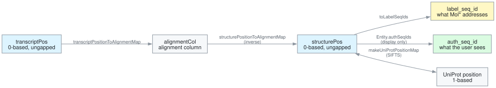

# Coordinate conventions

One residue has up to four numbers. Mixing them causes the off-by-one bugs this
package's types prevent.

## The rule

**Every stored or computed coordinate is a 0-based position**: an index into the
ungapped structure sequence or the ungapped transcript sequence. That is the one
numbering that is dense and zero-based whatever the file.

`coordinates.ts` brands the three internal spaces so the compiler rejects mixing
them:

- `structurePos` — index into the ungapped structure sequence
- `transcriptPos` — index into the ungapped transcript sequence
- `alignmentCol` — column of the pairwise alignment

## Leaving the internal space

Two conversions leave it, and each has exactly one correct route.

### Mol\* wants `label_seq_id`

`label_seq_id` equals `position + 1` only for a file carrying `entity_poly_seq`
or SEQRES. A SEQRES-less PDB numbers its observed residues by author numbering
and leaves holes at unobserved loops, so `Entity.seqIds` carries the real ids.

Every crossing goes through one of:

- `toLabelSeqIds`
- `rangeToLabelSeqIds`
- `makeLabelSeqIdIndex`

### The user sees `auth_seq_id`

- The depositors' numbering, which papers and UniProt cite (1TUP position 154
  reads 248) and which Mol\*'s own hover shows.
- `Entity.authSeqIds` carries it.
- It is display-only: never feed it back into a map.

## UniProt positions

UniProt positions are 1-based. `pdbUniProtMapping` converts them with SIFTS
rather than assuming any offset.
